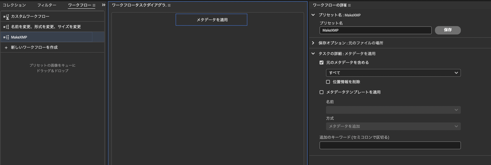

# imanage
写真撮影をする際に、jpg と raw の両方を保存している方向けのツールです。

## Environment
- MacOS
- Python 3.10~

## install
下記のコマンドでインストールとアンインストールが出来ます。
インストール後はコマンドとして`imanage`が使用可能な状態になります。

- インストール
```python setup.py develop```
- アンインストール
```python setup.py develop -u```


## 機能

### F-1 JPEG と RAW の仕分け
下記に示すようなファイルを含むディレクトリがあったとします。
```
.
├── 0000.jpg
├── 0000.raw
├── 0001.jpg
├── 0001.raw
├── 0002.jpg
└── 0002.raw
```

このディレクトリをカレントディレクトリとした状態で、コマンド `imange` を実行すると下記のように画像ファイルを仕分けることができます。
```
.
├── jpg
│   ├── 0000.jpg
│   ├── 0001.jpg
│   └── 0002.jpg
└── raw
    ├── 0000.raw
    ├── 0001.raw
    └── 0002.raw
```
`jpg` ・ `raw` ディレクトリに振り分けるファイルは拡張子で識別します。対象は、`main.py` の行頭に記載しています。主要なメーカーのファイルフォーマットを記載しているつもりですが、動作しない場合は下記のリストに拡張子を追加することができます。

```
target_jpg_extensions = ["JPG", "JPEG", "jpg", "jpeg"]
target_raw_extensions = ["ARW", "RAF", "CR3", "CR2", "NEF"]
```

### F-2 同名 jpg が存在しない raw を削除
jpg ディレクトリにある画像ファイルを対象に間引きを行ったとします。例えば、先の例で 0001.jpg が映りの悪い写真で削除したとします。そうなると、現像を絶対にしない無駄な 0001.raw が残ってしまいます。

```
.
├── jpg
│   ├── 0000.jpg
│   └── 0002.jpg
└── raw
    ├── 0000.raw
    ├── 0001.raw
    └── 0002.raw
```

そこで、`imanage -j` のようにオプションを指定することで、raw ディレクトリにおいて、jpg ディレクトリに存在しないファイルを削除することができます。
なお、削除対象となるファイルは `target_raw_extensions` で指定した拡張子を持つファイルです。

```
.
├── jpg
│   ├── 0000.jpg
│   └── 0002.jpg
└── raw
    ├── 0000.raw
    └── 0002.raw
```

### F-3 jpg の XMP メタデータを raw に同期
[Adobe Bridge](https://www.adobe.com/jp/products/bridge.html) を利用して jpg ディレクトリにある画像に対してレーティング(★評価)やラベルをつけたとします。
それらのメタデータを raw ディレクトリに存在する同名の画像に対して、同期をすることができます。

まず、同期をする対象であるメタデータは XMP と呼ばれる形式で保管されています。
XMP とは Adobe 関連ソフトが使用する XML ベースのメタデータ形式であす。Adobe Bridge で付与したメタデータは、Adobe Lightroom 等でも見ることが出来ます。
*(Bridge Lightroom　を比較したとき、前者はカタログにファイルを追加する必要がないため気軽に作業ができるといった特徴がある)

XMP の読み取りには　`exempi` に含まれるライブラリが必要です。exempi のインストールと伴に、ラッパーの Python XMP Toolkit もインストールします。これらのインストール方法は下記のページを参考にしてください。

https://python-xmp-toolkit.readthedocs.io/en/latest/installation.html

exempi のインストールに少々手こずったので、当時実行したコマンドを示します。

- コンパイラ boost のインストール

```
brew install boost
```

-  exempi のインストール

下記のサイトよりダウンロードしたパッケージのディレクトリ内で下記のコマンドを実行
  https://libopenraw.freedesktop.org/exempi/

`--with-boost`には、boost の実行形態がある場所を指定する。これは brew のバージョンによって異なるようです。

```
./configure --with-boost=/opt/homebrew/opt/boost
make
sudo make install
```


メタデータを同期する場合には、`imanage -s` というオプションをつけてコマンドを実行します。
このときいくつか注意点があります。

- [1] jpg, raw ディレクトリにあるファイルには事前に XMP のテンプレートが付与されている必要がある。
- [2] imanage -s は 内部で imanage -j と同じ処理が実行される。
- [3] jpg ディレクトリと raw ディレクトリには同名のファイルのみが揃っていることが前提である。

[1] に関して。XMP のテンプレートは Adobe Bridge のワークフロー等を使用して一括付与しないとこのメタデータの同期はできません。
(jpg は XMP がヘッダーに格納される。SONY のカメラの raw ファイル形式である ARW は <画像ファイル名>.xmp というファイルが同一ディレクトリに生成される)
